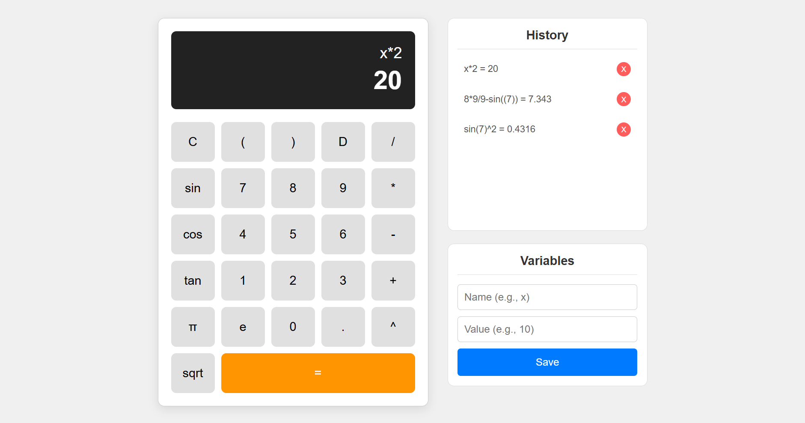

# Advanced Web Calculator


A powerful, feature-rich scientific calculator application built with modern vanilla JavaScript (ES6+), HTML5, and CSS3. This project demonstrates a strong understanding of core web development concepts, including DOM manipulation, state management, event handling, and the integration of third-party libraries.

**Live Demo:** [**https://ely-ramzan.github.io/devsinc-project01/**](https://ely-ramzan.github.io/devsinc-project01/) 

---

## Screenshot


---

## Features

This calculator goes beyond basic arithmetic and includes a full suite of features required for scientific and algebraic calculations.

#### Core Calculation Engine:
- **Full Mathematical Parsing:** Powered by the robust `math.js` library for safe and accurate evaluation of complex expressions.
- **Standard Operations:** Addition (`+`), Subtraction (`-`), Multiplication (`*`), Division (`/`).
- **Advanced Operations:** Exponentiation (`^`) and Square Root (`sqrt(number)` syntax).
- **Trigonometric Functions:** `sin()`, `cos()`, and `tan()`.
- **Mathematical Constants:** `pi` (or `π`) and `e` are fully supported.
- **Order of Operations:** Correctly handles operator precedence and nested parentheses `( )` automatically.

#### User Interface & Experience:
- **Editable Display:** A fully editable input field allows users to type expressions directly with their keyboard or use the on-screen buttons.
- **Responsive Layout:** The interface is designed with Flexbox and Grid for usability across different screen sizes.
- **Real-time Feedback:** The result is shown in a separate, clear display area without overwriting the user's input.
- **Intuitive Error Handling:** Displays a clear "Error" message for invalid expressions (e.g., division by zero, syntax errors) without crashing the application.

#### State Management & Persistence:
- **User-Defined Variables:** Users can create and store their own variables (e.g., `x = 10`) and use them in subsequent calculations (`x * 5`). Includes validation to prevent using reserved names.
- **Persistent History Panel:** A dedicated, scrollable panel displays a complete history of all calculations.
- **Local Storage:** The calculation history is saved to the browser's `localStorage`, ensuring it persists even after the page is refreshed.
- **Interactive History:** Users can click on any history item to load it back into the input for re-use or modification.
- **History Management:** Individual history items can be deleted with a single click.

---

## Technologies Used

- **HTML5:** For the core structure and semantics of the application.
- **CSS3:** For all styling, layout (Flexbox & Grid), and responsiveness.
- **Vanilla JavaScript (ES6+):** For all application logic, DOM manipulation, and event handling.
- **Math.js:** An external library for safely parsing and evaluating complex mathematical expressions.

---

## Getting Started

You can interact with the live demo or run the project on your local machine.

### Prerequisites

All you need is a modern web browser that supports HTML5, CSS3, and JavaScript.

### Local Installation

To run this project on your local machine, follow these simple steps:

1.  **Clone the repository:**
    ```bash
    git clone https://github.com/ely-ramzan/devsinc-project01.git
    ```

2.  **Navigate to the project directory:**
    ```bash
    cd devsinc-project01
    ```

3.  **Open the application:**
    Simply open the `index.html` file in your favorite web browser. No complex setup or build steps are required.

---

## Project Structure

The project is organized into three main files, demonstrating a clear separation of concerns: